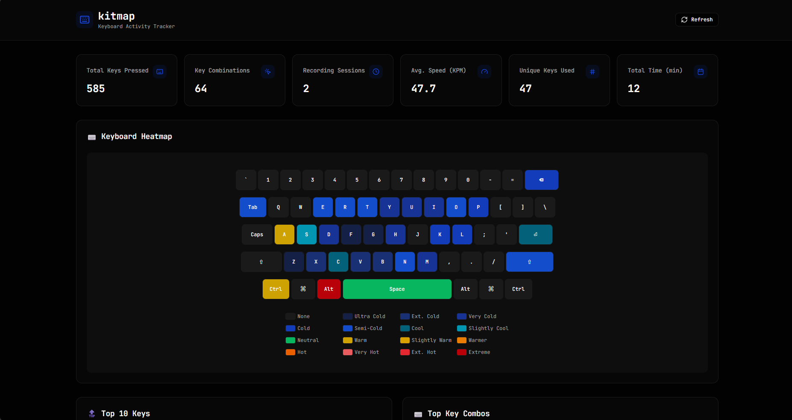
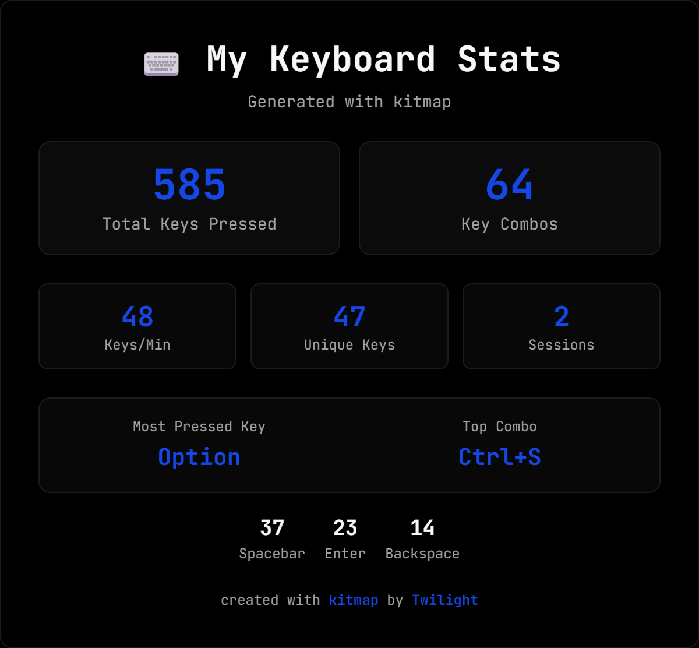

# kitmap

A cross-platform CLI for tracking keyboard usage and generating beautiful heatmaps and statistics, built with Rust and React.




## Features

- **Listen Command** (`kitmap listen`) - Records all key presses system-wide

  - Tracks individual keys and key combinations
  - Monitors modifier keys (Shift, Ctrl, Cmd, Alt)
  - Calculates typing speed in real-time
  - Stores data efficiently in SQLite

- **Preview Command** (`kitmap preview`) - View your keyboard statistics

  - ASCII keyboard heatmap in terminal
  - Web-based dashboard with React & shadcn/ui (`--web` flag)
  - Beautiful charts and visualizations
  - Shareable social media image with watermark

- **Reset Command** (`kitmap reset`) - Clear all recorded data

## Shareable Image

You can share your kitmap stats with others by generating a shareable image from the web ui. Here's a preview of the shareable image:


## Installation

### Prerequisites

- Rust 1.70 or higher
- Node.js 18+ (for building web UI)

### Linux Dependencies

```bash
sudo apt-get install libx11-dev libxi-dev libxtst-dev
```

### Install via Cargo

Kitmap does not currently provide pre-built binaries.
To install the CLI, use [cargo](https://doc.rust-lang.org/cargo/getting-started/installation.html):

```bash
cargo install kitmap
```

### Build from Source

```bash
# Clone the repository
git clone https://github.com/twlite/kitmap.git
cd kitmap

# Build the web UI
cd web
bun install
bun run build
cd ..

# Build the Rust CLI
cargo build --release

# The binary will be at ./target/release/kitmap
```

## Usage

### Start Recording

```bash
# Start listening to keyboard events
kitmap listen
```

Press `Ctrl+C` to stop recording. All data is saved to a local SQLite database.

### View Statistics

```bash
# ASCII heatmap in terminal
kitmap preview

# Web-based visualization
kitmap preview --web

# Custom port for web server
kitmap preview --web --port 8080
```

### Reset Data

```bash
# Clear all recorded data (with confirmation)
kitmap reset

# Force reset without confirmation
kitmap reset --force
```

## Web Dashboard

The web dashboard (`kitmap preview --web`) provides:

- **Keyboard Heatmap** - Visual representation of key usage frequency
- **Statistics Cards** - Total keys, combos, sessions, typing speed
- **Top Keys Chart** - Bar chart of most pressed keys
- **Key Combos Chart** - Most used key combinations
- **Hourly Activity** - When you type the most
- **Daily Activity** - Typing patterns by day of week
- **Key Types Distribution** - Letters, numbers, modifiers breakdown
- **Special Keys** - Spacebar, Enter, Backspace, etc.
- **Shareable Image** - Generate a social media-friendly stats card

## Statistics Tracked

- Total keys pressed
- Key combinations used
- Most pressed key
- Most pressed combo
- Spacebar, Enter, Backspace counts
- Arrow keys usage
- Modifier keys (Shift, Ctrl, Cmd, Alt)
- Hourly activity distribution
- Daily activity distribution
- Typing speed (characters per minute)
- Recording sessions

## Cross-Platform Support

KitMap works on:

- ✅ Linux (X11)
- ✅ macOS
- ✅ Windows

## Technology Stack

### Backend (Rust)

- `clap` - CLI argument parsing
- `rdev` - Cross-platform keyboard event listening
- `rusqlite` - SQLite database
- `axum` - Web server for dashboard
- `tokio` - Async runtime
- `chrono` - Date/time handling
- `serde` - Serialization

### Frontend (React)

- React
- TypeScript
- Tailwind CSS
- shadcn/ui components
- Recharts for visualizations
- html-to-image for shareable images

## Privacy

All keyboard data is stored **locally** in a SQLite database in your user data directory:

- Linux: `~/.local/share/kitmap/kitmap.db`
- macOS: `~/Library/Application Support/com.twilight.kitmap/kitmap.db`
- Windows: `C:\Users\<User>\AppData\Roaming\twilight\kitmap\kitmap.db`

No data is ever sent to any server. Your keystrokes stay on your machine.

You can also use the `kitmap db` command to show the database path.

## License

MIT License - see [LICENSE](LICENSE) for details.
